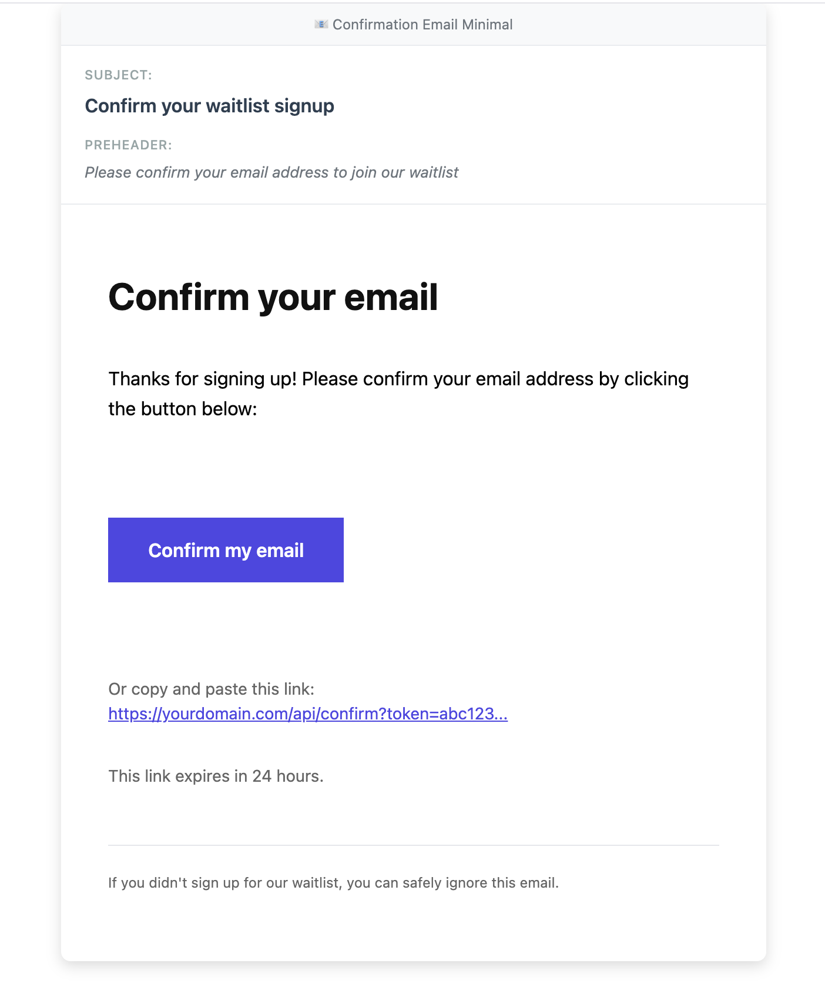
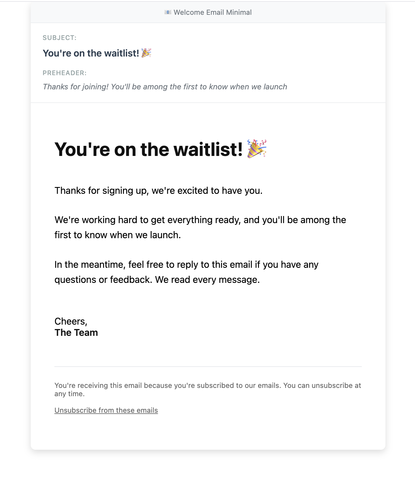

# emberwisp waitlist widget (v1)

[](https://opensource.org/licenses/MIT)
[](https://github.com/sturdy-barnacle/emberwisp-waitlist)

Simple, tinkerer-friendly, mostly-drop-in waitlist widget built to work on static sites: Jekyll, plain HTML, React, Astro, Hugo, or anything that can POST JSON.


**New to this project?** Check out the [Quick Start Guide](docs/QUICKSTART.md) to get up and running in minutes.

**Have questions?** See the [FAQ](docs/FAQ.md) for common questions about DNS records, troubleshooting, customization, and more.

## TL;DR: Files to Copy to Your Jekyll Site

Copy these 9 files from this repository to your Jekyll site:

| Source File | Destination in Jekyll Site |
|------------|---------------------------|
| `the-widget/jekyll/_includes/waitlist-form.html` | `_includes/waitlist-form.html` |
| `the-widget/assets/waitlist-form.css` | `assets/waitlist-form.css` |
| `the-widget/assets/waitlist-form.js` | `assets/waitlist-form.js` |
| `the-widget/assets/waitlist-pages.css` | `assets/waitlist-pages.css` |
| `the-widget/assets/waitlist-style.js` | `assets/waitlist-style.js` |
| `the-widget/jekyll/waitlist-confirmed.html` | Root folder (same level as `_config.yml`) |
| `the-widget/jekyll/waitlist-error.html` | Root folder (same level as `_config.yml`) |
| `the-widget/jekyll/unsubscribe-success.html` | Root folder (same level as `_config.yml`) |
| `the-widget/jekyll/unsubscribe-error.html` | Root folder (same level as `_config.yml`) |

**Quick copy commands** (replace `PATH_TO_REPO` with your repository path):
```bash
cp PATH_TO_REPO/the-widget/jekyll/_includes/waitlist-form.html _includes/
cp PATH_TO_REPO/the-widget/assets/waitlist-form.css assets/
cp PATH_TO_REPO/the-widget/assets/waitlist-form.js assets/
cp PATH_TO_REPO/the-widget/assets/waitlist-pages.css assets/
cp PATH_TO_REPO/the-widget/assets/waitlist-style.js assets/
cp PATH_TO_REPO/the-widget/jekyll/waitlist-confirmed.html .
cp PATH_TO_REPO/the-widget/jekyll/waitlist-error.html .
cp PATH_TO_REPO/the-widget/jekyll/unsubscribe-success.html .
cp PATH_TO_REPO/the-widget/jekyll/unsubscribe-error.html .
```

**Then:**
1. Add the form to any page: ``
2. (Optional) Add meta tags to your layout to match form style and color with email settings:
   ```html
   <meta name="waitlist-style" content="minimal">
   <meta name="waitlist-color" content="#4f46e5">
   ```
   - `waitlist-style`: Use `minimal`, `professional`, or `branded` to match your `EMAIL_TEMPLATE_STYLE` setting
   - `waitlist-color`: Use your `EMAIL_PRIMARY_COLOR` value (e.g., `#4f46e5`)
   
   If omitted, pages will automatically use the style and color from API redirects, and the form defaults to `minimal` style with purple color.

3. The CSS/JS files are already loaded in the included files and pages - no additional setup needed!
---

## FYI
While this widget is customizable for use with probably whatever set up you've got, it was created with the following stack in mind:
| Name | Layer | Is this layer required? |
|---|---|---|
| Jekyll | website/blog framework / you have a website, yeah? | yes |
| Supabase | database / where subscriber info gets stored | yes |
| Resend | email API / what does the sending | yes |
| Upstash | database / used for rate limiting | no |
| Cloudflare Turnstile | CAPTCHA / anti-spam | no |

Could you use _just_ Supabase for both subscriber info and rate limiting? Technically yes, but Upstash Redis is better for the type and speed of data transfer required for this feature. Anyway, it's also got a very generous free tier. 😉

| |	Upstash Redis | Supabase |
|---|---|---|
| Speed | ~1-5ms (in-memory)	| ~50-100ms (database query) |
| Atomicity	| Built-in atomic INCR	| Requires transactions/locks |
| TTL	| Automatic key expiration	| Need cleanup job or triggers |
| Complexity	| @upstash/ratelimit does everything	| Custom implementation needed |
| Free tier? | yes | yes |

---

## ⚠️ Important: How This Works

**This is a drop-in plugin with a separate API backend:**

- **The API** (`the-widget` from this repository) → Deploy to **Vercel**
     - This is a one-time setup and shouldn't take more than 30min to an hour, including time spent signing up for (the free tier of) required services that you don't have yet, template customization, and testing. 
- **Your website** (Jekyll, React, etc.) → Stays **wherever it's already hosted** (Could be a separate project instance on Vercel, GitHub Pages, Netlify, etc.)
- **The form** → You copy some files (CSS/JS/HTML) to your existing website
- **They communicate** → Your form sends requests to the API you just deployed

## Features

- ✅ **Email validation** and duplicate prevention
- ✅ **Unified contact system** with deduplication and merging
- ✅ **Resend Contacts sync** with two-way sync (optional - sync confirmed users to Resend Audience)
- ✅ **3 email template styles** (minimal/default, professional, branded)
- ✅ **Logo support** (optional logos for Professional and Branded templates; branded includes placeholder SVG by default)
- ✅ **Full customization** (colors, content, subjects, preheaders, logos)
- ✅ **Email preview system** for testing templates
- ✅ **SPAM compliance** (CAN-SPAM, GDPR: unsubscribe links, physical address, optional advertisement disclosure)
- ✅ **GDPR compliance** (privacy policy links in emails and form, consent checkbox) - Note: Data deletion/export endpoints not yet implemented
- ✅ **Welcome emails** via **Resend** (required - see note below)
- ✅ **Rate limiting** via Upstash Redis (optional)
- ✅ **CAPTCHA** via Cloudflare Turnstile (optional)
- ✅ **Double opt-in** email confirmation (optional, on by default)
- ✅ **Supabase storage** with contact activity tracking
- ✅ **CORS configuration**
- ✅ **Dark mode support**

**⚠️ Email Service Requirement:** This widget uses **Resend** for sending emails. The API code (`api/subscribe.js` and `api/confirm.js`) is hardcoded to use Resend. If you want to use a different email service (SendGrid, Mailgun, AWS SES, etc.), you will need to modify the API code yourself. The database schema is email-service agnostic and will work with any provider.

## Architecture

```
┌─────────────────┐     ┌──────────────────────────────────────┐
│   Frontend      │     │            Vercel Functions          │
│  (Any Framework)│     │                                      │
│                 │     │  /api/subscribe                      │
│  waitlist-form  │────▶│    ├─ Rate limit check (Upstash)     │
│                 │     │    ├─ CAPTCHA verify (Turnstile)     │
└─────────────────┘     │    ├─ Contact deduplication         │
                        │    ├─ Store signup (Supabase)        │
                        │    └─ Send confirmation (Resend)     │
                        │                                      │
                        │  /api/confirm                        │
                        │    ├─ Validate token                 │
                        │    ├─ Mark confirmed (Supabase)      │
                        │    ├─ Sync to Resend Contacts ←───────── Optional
                        │    └─ Send welcome email (Resend)    │
                        │                                      │
                        │  /api/unsubscribe                    │
                        │    ├─ Validate token/email           │
                        │    ├─ Update unsubscribe status      │
                        │    ├─ Sync to Resend Contacts ←───────── Optional
                        │    └─ Log activity                   │
                        │                                      │
                        │  /api/webhooks/resend  ←───────────────── Optional
                        │    └─ Receive Resend events          │
                        │       (bounces, unsubscribes)        │
                        └──────────────────────────────────────┘
                                           │
                        ┌──────────────────┴───────────────────┐
                        │                                      │
              ┌─────────▼─────────┐              ┌─────────────▼─────────┐
              │   Database Layer  │              │   Resend Contacts     │
              │    (Supabase)     │◄────────────►│     (Optional)        │
              │                   │   Two-way    │                       │
              │  waitlist         │    sync      │  Audience for         │
              │    └─contact_id──┼──contacts    │  marketing emails     │
              │  contact_activity │              │                       │
              └───────────────────┘              └───────────────────────┘
```

**Database relationships:**
- `waitlist.contact_id` → `contacts.id` - Links each signup to a unified contact
- One contact can have multiple waitlist signups from different sources
- `contacts.user_id` → `auth.users.id` - Optional link to Supabase Auth users

## Framework Compatibility

The API (`api/` folder) is **completely framework-agnostic**: any frontend that can POST JSON will work. The `jekyll/` folder contains ready-to-use components for Jekyll, but they're easy to adapt.

| Component | Framework-specific? | To adapt |
|-----------|---------------------|----------|
| `api/*` | No: works with anything | Just deploy to Vercel |
| `api/shared/*` | No: shared utilities | Modify if customizing email service |
| `the-widget/supabase/setup.sql` | No: just SQL | Run in Supabase SQL Editor |
| `assets/waitlist-form.css` | No: pure CSS | Use as-is or customize |
| `assets/waitlist-form.js` | No: vanilla JS | Use as-is or customize |
| `jekyll/_includes/waitlist-form.html` | Light Jekyll (Liquid tags) | See below |
| `jekyll/waitlist-*.html` | Light Jekyll (front matter) | See below |

### API Structure

The API is organized into shared modules for easier customization:

- `api/subscribe.js` - Main subscription endpoint
- `api/confirm.js` - Email confirmation endpoint
- `api/unsubscribe.js` - Unsubscribe endpoint
- `api/webhooks/resend.js` - Resend webhook handler (for two-way sync)
- `api/shared/config.js` - Centralized configuration (CORS, feature flags, etc.)
- `api/shared/email-service.js` - Email sending abstraction (modify here to use different email service)
- `api/shared/resend-contacts.js` - Resend Contacts API integration (for syncing to Audience)
- `api/shared/contacts.js` - Contact management utilities
- `api/shared/database.js` - Database client initialization
- `api/shared/utils.js` - Shared utility functions
- `scripts/sync-contacts-to-resend.js` - Bulk sync script for existing contacts

### Using with Other Frameworks

**Plain HTML / Vanilla JS:**
Copy the HTML from `waitlist-form.html`, and include the CSS/JS files:
- Copy `assets/waitlist-form.css` to your site
- Copy `assets/waitlist-form.js` to your site
- Add data attributes to the form container: `data-api-url`, `data-source`, `data-turnstile-site-key`
- Link the CSS and JS files in your HTML

**React / Next.js:**
Import `assets/waitlist-form.css` and adapt `assets/waitlist-form.js` to React hooks. The JavaScript logic maps directly to React patterns with `useState` for loading/message states.

**Astro:**
Nearly drop-in. Astro supports similar component includes. Swap Liquid syntax for Astro's `Astro.props`.

**Hugo:**
Move to `layouts/partials/`, replace Liquid (`{{ include.x }}`) with Go templating (`{{ .Get "x" }}`).

**Webflow / Squarespace / No-code:**
Upload `assets/waitlist-form.css` and `assets/waitlist-form.js` to your site's assets folder, then embed the HTML from `waitlist-form.html` in a custom code block. Set data attributes: `data-api-url`, `data-source`, `data-turnstile-site-key`.

## Setup

> **📖 For step-by-step setup instructions, see the [Quick Start Guide](docs/QUICKSTART.md).**

**Quick overview:**

1. **Supabase** - Create project, run `the-widget/supabase/setup.sql`, get API credentials
2. **Resend** - Create account, verify domain, create API key
3. **Vercel** - Deploy `the-widget/` folder, import `.env.local` with your credentials
4. **Your Site** - Copy form files and add to your website

**What you'll need:**
- [Supabase](https://supabase.com) account (free tier)
- [Resend](https://resend.com) account (free tier: 3,000 emails/month)
- [Vercel](https://vercel.com) account (free tier)
- Node.js installed

**Optional (add later):**
- [Upstash](https://upstash.com) for rate limiting (free tier: 10k requests/day)
- [Cloudflare Turnstile](https://dash.cloudflare.com/?to=/:account/turnstile) for CAPTCHA (always free)

**⚠️ Important: Resend is Required**

The provided API code (`api/subscribe.js` and `api/confirm.js`) **requires Resend** and is hardcoded to use it. If you want to use a different email service, you'll need to modify the API code. The database schema is email-service agnostic and will work with any provider.

**What gets created in Supabase:**
- `waitlist` table - Stores signup entries (linked to contacts via `contact_id`)
- `contacts` table - Unified contact management (single source of truth for email identity)
  - Email status fields: `email_verified`, `email_bounced`, `email_unsubscribed`
  - Lifecycle tracking: `first_seen_at`, `last_contacted_at`
  - Optional `user_id` column for Supabase Auth integration (links to `auth.users` when contact creates account)
  - NULL for waitlist signups that never create accounts - this is expected and safe
- `contact_activity` table - Timeline tracking for all contact interactions (optional, for CRM features)
- `waitlist_stats` view - Statistics including unique contacts count
- Helper functions: `get_or_create_contact()`, migration functions, merge/deduplication functions, unsubscribe token generation
- Indexes for performance (including `email_normalized` for fast lookups)

### 2b. Set Up Resend Contacts Sync (Optional)

*Optional but recommended if you want to send marketing emails to confirmed subscribers.*

**What this does:** Syncs confirmed waitlist subscribers to a Resend Audience, enabling two-way sync of subscription preferences (bounces, unsubscribes).

**Sync is automatic once configured.** A manual migration script is available to sync existing contacts from Supabase to Resend.

| Direction | Trigger | Automatic? |
|-----------|---------|------------|
| Supabase → Resend | User confirms email | ✅ Yes |
| Supabase → Resend | User unsubscribes via your app | ✅ Yes |
| Resend → Supabase | Bounce/complaint/unsubscribe | ✅ Yes (webhook) |
| Existing contacts | One-time migration | Manual script |

**Quick setup:**
1. Create a Resend Audience at [resend.com/audiences](https://resend.com/audiences)
2. Add `RESEND_AUDIENCE_ID` to Vercel environment variables (via dashboard)
3. Set up webhooks at [resend.com/webhooks](https://resend.com/webhooks) pointing to `https://your-api.vercel.app/api/webhooks/resend`
4. Add `RESEND_WEBHOOK_SECRET` to Vercel environment variables
5. Redeploy

**For detailed setup instructions**, see [docs/QUICKSTART.md](docs/QUICKSTART.md#optional-resend-contacts-sync).

**Bulk sync existing contacts:**
```bash
# Preview what would be synced
node scripts/sync-contacts-to-resend.js --dry-run

# Sync all confirmed contacts
node scripts/sync-contacts-to-resend.js
```

### 3. Deploy the API to Vercel

**What this does:** Deploys the `the-widget/` folder to Vercel as a serverless API. This is **separate from your website** - your website stays wherever it's hosted.

**Quick steps:**
1. Navigate to `the-widget` folder: `cd the-widget`
2. Install dependencies: `npm install`
3. Create environment file: `cp env.example .env.local`
4. Fill in **REQUIRED** values in `.env.local`:
   - `SUPABASE_URL`, `SUPABASE_SERVICE_KEY` (from Step 1)
   - `RESEND_API_KEY`, `FROM_EMAIL` (from Step 2)
   - `BASE_URL` (your website URL)
   - `CORS_ALLOWED_ORIGINS` (your domains)
5. Deploy via Vercel dashboard (import `.env.local`) or CLI: `vercel --prod`
6. Set `BASE_URL` to **Production** environment only in Vercel dashboard

**📖 For detailed step-by-step instructions with ELI5 explanations, see [docs/QUICKSTART.md](docs/QUICKSTART.md#step-3-deploy-the-api-to-vercel).**

### Optional Features

**Rate Limiting (Upstash):** Prevents spam by limiting signups per IP address. Default: 5 signups per IP per hour.

**CAPTCHA (Cloudflare Turnstile):** Adds bot protection to your form.

**📖 For setup instructions**, see [docs/QUICKSTART.md](docs/QUICKSTART.md#optional-add-rate-limiting) and [docs/QUICKSTART.md](docs/QUICKSTART.md#optional-add-captcha).

### 4. Add to Your Site

The `jekyll/` folder contains ready-to-use components. Adapt as needed for your framework.

**For Jekyll:**

**📖 For detailed step-by-step instructions, see [docs/QUICKSTART.md](docs/QUICKSTART.md) - it includes ELI5-level explanations for each step.**

**Quick summary:**

1. **Copy 9 files to your Jekyll site:**
   - `jekyll/_includes/waitlist-form.html` → `_includes/` (the form component)
   - `assets/waitlist-form.css` → `assets/` (form styling)
   - `assets/waitlist-form.js` → `assets/` (form functionality)
   - `assets/waitlist-pages.css` → `assets/` (confirmation page styling)
   - `assets/waitlist-style.js` → `assets/` (automatic style matching)
   - `jekyll/waitlist-confirmed.html` → your site root (success page)
   - `jekyll/waitlist-error.html` → your site root (error page)
   - `jekyll/unsubscribe-success.html` → your site root (unsubscribe success page)
   - `jekyll/unsubscribe-error.html` → your site root (unsubscribe error page)

2. **Add the form to any page:**
   ```liquid
   
   ```
   Replace `your-waitlist-api.vercel.app` with your actual Vercel API URL.

3. **(Optional) Match form style and color with email settings** - Add to your layout file (`_layouts/default.html`):
   ```html
   <meta name="waitlist-style" content="minimal">
   <meta name="waitlist-color" content="#4f46e5">
   ```
   - `waitlist-style`: Use `minimal`, `professional`, or `branded` to match your `EMAIL_TEMPLATE_STYLE`
   - `waitlist-color`: Use your `EMAIL_PRIMARY_COLOR` value (e.g., `#4f46e5`)
   
   If omitted, pages automatically use the style and color from API redirects, and the form defaults to `minimal` style with purple color.

**Note:** CSS/JS files are automatically loaded by the included files and pages - no manual setup needed!

**Advanced options:**

   **With source tracking:**
   ```liquid
   
   ```

   **With CAPTCHA:**
   ```liquid
   
   ```

   **With privacy policy (enables consent checkbox for GDPR compliance):**
   ```liquid
   
   ```

   **All options:**
   ```liquid
   
   ```

**For other frameworks:**

See the "Framework Compatibility" section above for adaptation instructions.

### Why Jekyll as the Reference?

The `jekyll/` folder exists because Jekyll is the lowest common denominator for static sites:

- **No build step required**: The components are just HTML, CSS, and vanilla JS. There's no JSX to transpile, no bundler to configure.
- **Easy to copy-paste**: If you can read the Jekyll version, you can adapt it to anything. React developers know how to convert vanilla JS to hooks; the reverse is harder.
- **Static site = needs external API**: Jekyll can't run server-side code, which is exactly why this Vercel-based architecture exists. If you're using Next.js, you might just put the API route in your own app.
- **Common for landing pages**: Many indie projects use Jekyll (or Hugo, or plain HTML) for marketing sites while building the actual product in something else.

The Jekyll-specific bits are minimal: just Liquid's `{{ include.param }}` syntax and the YAML front matter on the confirmation pages. The CSS and JavaScript in `assets/` are framework-agnostic and can be used with any static site generator or framework.

---

## Security Features

### Rate Limiting

When Upstash is configured, each IP address is limited to **5 signups per hour**. This prevents:
- Spam attacks
- Email list bombing
- Resource exhaustion

The limit can be adjusted in `api/subscribe.js`:
```js
limiter: Ratelimit.slidingWindow(5, '1 h'), // Change as needed
```

### CAPTCHA (Cloudflare Turnstile)

When enabled, users must complete a CAPTCHA challenge before submitting. Turnstile is:
- Privacy-friendly (no tracking)
- Usually invisible (smart challenge)
- Free for any volume

### Double Opt-in

Enabled by default. The flow is:

1. User submits email → receives confirmation email
2. User clicks confirmation link → marked as confirmed, receives welcome email

Benefits:
- Prevents fake signups
- Confirms email ownership
- Reduces spam complaints
- Required for GDPR compliance in some cases

To disable, set `DOUBLE_OPTIN=false` in your environment.

---

## API Reference

### POST /api/subscribe

**Request:**
```json
{
  "email": "user@example.com",
  "source": "homepage",
  "turnstileToken": "..." // Only if CAPTCHA enabled
}
```

**Responses:**

| Status | Body | Meaning |
|--------|------|---------|
| 200 | `{ success: true, requiresConfirmation: true }` | Signup saved, confirmation email sent |
| 200 | `{ success: true }` | Signup confirmed (if double opt-in disabled) |
| 409 | `{ error: "already_subscribed" }` | Email already on waitlist |
| 429 | `{ error: "rate_limited" }` | Too many requests from this IP |
| 400 | `{ error: "captcha_required" }` | CAPTCHA token missing |
| 400 | `{ error: "captcha_failed" }` | CAPTCHA verification failed |

### GET /api/confirm?token=xxx

Handles email confirmation clicks. Redirects to:
- `/waitlist-confirmed` on success
- `/waitlist-error?error=<code>` on failure

### GET /api/unsubscribe?token=xxx

Handles unsubscribe requests. Accepts either `token` (secure) or `email` (fallback). Redirects to:
- `/unsubscribe-success` on success
- `/unsubscribe-error?reason=<code>` on failure

### POST /api/webhooks/resend

*Optional - only if Resend Contacts sync is configured.*

Receives webhook events from Resend for two-way sync:

| Event | Action |
|-------|--------|
| `email.bounced` | Sets `email_bounced = true` in contacts |
| `email.complained` | Sets `email_unsubscribed = true` |
| `contact.unsubscribed` | Sets `email_unsubscribed = true` |
| `email.delivered/opened/clicked` | Logged to `contact_activity` |

**Response:** `200 OK` with `{ received: true }`

---

## Database Schema

The database includes a unified contacts system that links waitlist signups to contacts and optionally to Supabase Auth users.

**Main tables:**

```sql
-- Waitlist signups (linked to contacts via contact_id)
create table waitlist (
  id uuid primary key default gen_random_uuid(),
  email text unique not null,
  source text default 'website',
  created_at timestamptz default now(),
  confirmed boolean default false,
  confirmed_at timestamptz,
  confirmation_token text,
  token_expires_at timestamptz,
  metadata jsonb default '{}',
  contact_id uuid references contacts(id) on delete cascade -- Links to unified contact
);

-- Unified contacts (single source of truth for email identity)
create table contacts (
  id uuid primary key default gen_random_uuid(),
  email text unique not null,
  email_normalized text unique not null, -- Lowercase, trimmed for deduplication
  created_at timestamptz default now(),
  updated_at timestamptz default now(),
  
  -- Supabase Auth integration (optional)
  user_id uuid references auth.users(id) on delete set null,
  
  -- Email status (email-service agnostic, updated via webhooks)
  email_verified boolean default false,
  email_verified_at timestamptz,
  email_bounced boolean default false,
  email_bounced_at timestamptz,
  email_unsubscribed boolean default false,
  email_unsubscribed_at timestamptz,
  unsubscribe_token text unique, -- For secure unsubscribe links
  
  -- Lifecycle tracking
  first_seen_at timestamptz default now(), -- First contact with this email
  last_contacted_at timestamptz, -- Last time email was sent
  
  -- Flexible metadata
  metadata jsonb default '{}'::jsonb
);

-- Contact activity timeline (optional, for CRM features)
create table contact_activity (
  id uuid primary key default gen_random_uuid(),
  contact_id uuid references contacts(id) on delete cascade,
  activity_type text not null, -- 'waitlist_signup', 'email_sent', etc.
  activity_data jsonb default '{}'::jsonb,
  created_at timestamptz default now()
);
```

**Key relationships:**
- `waitlist.contact_id` → `contacts.id` - Links each waitlist signup to a unified contact
- `contacts.user_id` → `auth.users.id` - Optionally links contacts to Supabase Auth users
- `contact_activity.contact_id` → `contacts.id` - Timeline of all interactions

**Supabase Auth Integration:**
- The `contacts.user_id` column optionally links contacts to Supabase Auth users
- When a waitlist signup creates an account, you can link them: `UPDATE contacts SET user_id = auth_user_id WHERE email = user_email`
- NULL for waitlist signups that never create accounts - this is expected and safe
- Enables cross-system queries: "All waitlist signups who became app users"

### Stats View

```sql
select * from waitlist_stats;
```

Returns:
```json
{
  "confirmed_signups": 89,
  "pending_signups": 12,
  "total_signups": 101,
  "confirmed_last_24h": 5,
  "confirmed_last_7d": 23,
  "unique_sources": 3,
  "unique_contacts": 95
}
```

**Note:** `unique_contacts` counts distinct contacts linked to waitlist entries (one contact can have multiple signups from different sources).

---

## Customization

### Using a Different Email Service

The API is organized with shared modules, making it simple to customize.

**To use SendGrid, Mailgun, AWS SES, or another email service:**

1. Modify `api/shared/email-service.js`:
   - Replace the `sendConfirmationEmail()` function
   - Replace the `sendWelcomeEmail()` function
   - Update initialization to use your email service's SDK

2. Update `api/shared/config.js`:
   - Add your email service's API key to `EMAIL_CONFIG`
   - Update `fromEmail` if needed

3. Update `package.json`:
   - Remove `resend` dependency
   - Add your email service's SDK

**That's it!** The rest of the code will continue to work. The database schema is email-service agnostic.

### Email Templates

**Quick Template Selection** (Recommended):
```bash
# In your .env file, choose one of:
EMAIL_TEMPLATE_STYLE=minimal      # Simple, clean design (default)
EMAIL_TEMPLATE_STYLE=professional # Elegant serif, formal
EMAIL_TEMPLATE_STYLE=branded      # Custom brand colors
# Note: 'default' is an alias for 'minimal' (backward compatibility)
```

**Template Examples:**

<p align="center">
  
  <br/>
  <em>Confirmation email templates (minimal, professional, branded)</em>
</p>

<p align="center">
  
  <br/>
  <em>Welcome email templates (minimal, professional, branded)</em>
</p>

**Template Files**:
- **Configuration**: Environment variables or `the-widget/templates/config.js`
- **Default templates** (minimal style): `the-widget/templates/`
- **Style variations**: `the-widget/templates/examples/`
- **Complete guide**: `the-widget/templates/TEMPLATE_README.md`

**Quick customization via environment variables:**
```bash
EMAIL_TEMPLATE_STYLE=minimal          # or professional, branded
EMAIL_PROJECT_NAME=Your Project
EMAIL_SENDER_NAME=The Team
EMAIL_PRIMARY_COLOR=#4f46e5
EMAIL_LOGO_URL=https://yourdomain.com/logo.png
EMAIL_BRANDED_TEXT_ONLY=true         # For branded templates: show text header instead of logo

# SPAM Compliance (CAN-SPAM Act requirements)
EMAIL_SENDER_ADDRESS="123 Main St, City, State 12345"  # REQUIRED for marketing emails
EMAIL_ADVERTISEMENT_DISCLOSURE=                        # Optional: only if emails are promotional

# GDPR Compliance (Recommended)
EMAIL_PRIVACY_POLICY_URL=https://yourdomain.com/privacy  # Privacy policy link in emails and form
```

**Or edit `templates/config.js`** for detailed message customization.

**Preview Templates**:
```bash
npm run generate-email-previews
open example_emails/index.html
```

**For detailed instructions**, see the [Template Editing Guide](the-widget/templates/TEMPLATE_README.md).

### SPAM Compliance

**⚖️ Legal Compliance**: All emails include required elements to comply with CAN-SPAM Act and GDPR requirements.

**Required elements:**
1. **Unsubscribe links** - All welcome emails include functional unsubscribe links
2. **Physical postal address** - Required for commercial emails (set via `EMAIL_SENDER_ADDRESS`)
3. **Advertisement disclosure** - Optional, only needed if emails are promotional (set via `EMAIL_ADVERTISEMENT_DISCLOSURE`)

**How it works:**
1. **Secure tokens**: Each contact gets a unique unsubscribe token for secure unsubscribe links
2. **One-click unsubscribe**: Users can unsubscribe via `/api/unsubscribe?token=...` or `/api/unsubscribe?email=...`
3. **Activity tracking**: Unsubscribe events are logged in the contact activity timeline
4. **Success/error pages**: Users see appropriate feedback after unsubscribe attempts
5. **Physical address**: Automatically included in email footers when `EMAIL_SENDER_ADDRESS` is set
6. **Advertisement disclosure**: Automatically included in welcome emails when `EMAIL_ADVERTISEMENT_DISCLOSURE` is set

**Configuration:**
```bash
# REQUIRED for marketing emails (CAN-SPAM Act)
EMAIL_SENDER_ADDRESS="123 Main St, City, State 12345"
# Can be street address, P.O. Box, or private mailbox
# Multi-line addresses supported (use \n for line breaks)

# Optional - only if emails are promotional
EMAIL_ADVERTISEMENT_DISCLOSURE="This email is an advertisement."
# Leave blank if emails are transactional/relationship-based
# Default waitlist emails are NOT promotional
```

**Customization:**
```javascript
// In the-widget/templates/config.js
unsubscribeText: "Unsubscribe from these emails",
unsubscribeFooter: "You're receiving this email because you're subscribed to our emails. You can unsubscribe at any time.",
```

**Note:** The default unsubscribe message is generic and works seamlessly with both waitlist and future CRM features (newsletters, product updates, etc.). Physical address appears in both confirmation and welcome emails when configured.

### GDPR Compliance

**⚖️ Legal Compliance**: Additional GDPR compliance features for transparency and consent.

**Features:**
1. **Privacy policy links** - Automatically included in email footers when configured
2. **Consent checkbox** - Optional consent checkbox in waitlist form (appears when privacy policy URL is provided)

**Configuration:**
```bash
# Privacy policy URL (recommended for GDPR compliance)
EMAIL_PRIVACY_POLICY_URL=https://yourdomain.com/privacy
# Will appear in email footers and enable consent checkbox in form
```

**How it works:**
1. **Email footers**: Privacy policy link automatically appears in both confirmation and welcome emails when `EMAIL_PRIVACY_POLICY_URL` is set
2. **Form consent**: When privacy policy URL is provided to the form, a consent checkbox appears requiring users to agree before submitting
3. **Conditional display**: Both features only appear when the privacy policy URL is configured

**Form usage:**
```liquid

```

**Note:** Privacy policy links and consent checkboxes are optional but recommended for GDPR compliance, especially if you serve EU users. The privacy policy content itself must be created by you - this widget only provides the link/checkbox infrastructure.

**⚠️ Important: GDPR Data Deletion Not Yet Implemented**

The widget currently provides:
- ✅ Privacy policy links (transparency)
- ✅ Consent checkboxes (explicit consent)
- ✅ Unsubscribe functionality (marketing opt-out)

**Not yet implemented:**
- ❌ GDPR "Right to be Forgotten" (data deletion endpoint)
- ❌ GDPR "Data Portability" (data export endpoint)

**If users request data deletion:**
You must handle deletion requests manually. See [docs/GDPR_DATA_ENDPOINTS_SCOPE.md](docs/GDPR_DATA_ENDPOINTS_SCOPE.md) for implementation guidance. The scope document outlines what needs to be built, but the endpoints are not yet implemented.

**Manual deletion options:**
- Delete records directly in Supabase dashboard
- Use SQL queries to anonymize data
- Remove from Resend Contacts manually (if synced)

For full GDPR compliance, you may need to implement deletion/export endpoints or handle requests manually until they are built.

**Database fields:**
- `contacts.email_unsubscribed` - Boolean flag
- `contacts.email_unsubscribed_at` - Timestamp
- `contacts.unsubscribe_token` - Secure token for unsubscribe links

**Redirect pages** (on your Jekyll site):
- `/unsubscribe-success` - Confirmation page (configurable via `UNSUBSCRIBE_SUCCESS_URL`)
- `/unsubscribe-error` - Error handling page (configurable via `UNSUBSCRIBE_ERROR_URL`)

**Style variations** are available in `the-widget/templates/examples/`:
- Professional (elegant serif, formal business style)
- Branded (colorful with header/footer sections)
- Note: Minimal style is now the default (root templates)

Templates use a simple `{{variable}}` system.

### Styling

The form uses scoped CSS classes (`.waitlist-form__*`) defined in `assets/waitlist-form.css`. You can:
- Override styles in your Jekyll theme's CSS
- Edit `assets/waitlist-form.css` directly to customize
- Use CSS variables or custom classes to theme the widget

### Rate Limits

Adjust in `api/subscribe.js`:
```js
limiter: Ratelimit.slidingWindow(10, '1 h'), // 10 per hour
limiter: Ratelimit.slidingWindow(3, '10 m'), // 3 per 10 minutes
```

### Confirmation Pages

Edit `waitlist-confirmed.html` and `waitlist-error.html` to match your site's design.

---

## Local Development

```bash
cd the-widget
npm install

# Create .env.local with your credentials
cp env.example .env.local

# Run locally
npm run start:dev
```

API available at `http://localhost:3000/api/subscribe`.

**Test the form locally:**
- Open `http://localhost:3000/` in your browser (testing hub)
- Or directly: `http://localhost:3000/local-test/test-form.html`
- This test page allows you to test the waitlist form without setting up a Jekyll site
- Make sure `npm run start:dev` is running before testing
- See `the-widget/local-test/README.md` for detailed testing instructions

---

## Cost Estimate

| Service | Free Tier | Notes |
|---------|-----------|-------|
| Vercel | 100GB bandwidth | More than enough |
| Supabase | 500MB database | Millions of emails |
| Resend | 3,000 emails/mo | Then $20/mo for 50k |
| Upstash | 10k requests/day | Then $0.20/100k |
| Turnstile | Unlimited | Always free |

**Total: $0/month** for most indie projects.

---

## Database Merging (Advanced)

If you need to merge multiple databases or import external contact data:

1. **Backup everything first** - Export all databases before merging
2. **Import data** - Use pg_dump/restore or manual import to combine databases  
3. **Analyze duplicates**: `SELECT * FROM public.analyze_duplicate_contacts();`
4. **Merge duplicates**: `SELECT * FROM public.merge_duplicate_contacts();`

See [docs/DATABASE_MERGE_GUIDE.md](docs/DATABASE_MERGE_GUIDE.md) for detailed instructions.

---

## Troubleshooting

For common issues and solutions, see the [FAQ](docs/FAQ.md) section.

**Quick fixes:**
- **CORS errors:** Add your domain to `CORS_ALLOWED_ORIGINS` environment variable and redeploy
- **Emails not sending:** Verify domain in Resend, check `FROM_EMAIL` matches
- **Rate limiting not working:** Check Upstash credentials are set correctly
- **CAPTCHA always fails:** Ensure site key (frontend) and secret key (backend) are from the same Turnstile widget
- **Confirmation links broken:** Check `BASE_URL` is set to your website URL (where confirmation pages live)

**For more help:** See [docs/FAQ.md](docs/FAQ.md) for detailed troubleshooting and common questions.

---

## Contributing

Contributions are welcome! Here's how you can help:

### Reporting Issues

Found a bug or have a feature request? Please [open an issue](https://github.com/sturdy-barnacle/emberwisp-waitlist/issues) with:
- A clear description of the problem or feature
- Steps to reproduce (for bugs)
- Your environment details (Node version, framework, etc.)

### Submitting Pull Requests

1. Fork the repository
2. Create a feature branch (`git checkout -b feature/amazing-feature`)
3. Make your changes
4. Test your changes thoroughly
5. Commit your changes (`git commit -m 'Add some amazing feature'`)
6. Push to the branch (`git push origin feature/amazing-feature`)
7. Open a Pull Request

### Development Guidelines

- Follow existing code style and patterns
- Add comments for complex logic
- Update documentation if needed
- Test your changes before submitting

### Areas for Contribution

- Additional framework integrations
- UI/UX improvements
- Performance optimizations
- Documentation improvements
- Bug fixes

---

## Contact

- Website: [emberwisp.xyz](https://emberwisp.xyz)
- Email: [k@emberwisp.xyz](mailto:k@emberwisp.xyz)
- GitHub: [@sturdy-barnacle](https://github.com/sturdy-barnacle)

---

## License

MIT
